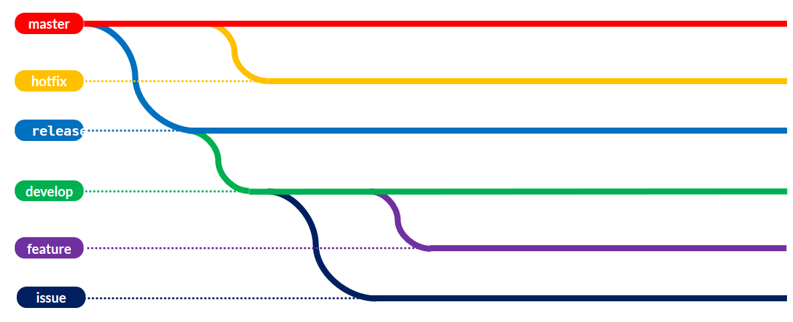

# Manejo de ramas
En este capítulo se explica como se realiza el manejo de las ramas para los proyectos en los repositorios de código de los proyectos Corona.
________
## Roles en el repositorio

* Developer
* Tester
* Product Owner
* Líder Equipo
* Deployer (opcional)

### Developer
Encargado del desarrollo de código al igual que las pruebas unitarias. Es responsable de aplicar **buenas prácticas de desarrollo**, desarrollar **pruebas unitarias** y garantizar que su código pueda ser integrado con el desarrollo de los demás miembros del equipo.

### Tester
Encargado de validar que el desarrollo cumple con las funcionalidades solicitadas por el cliente. Su principal responsabilidad es ejecutar **pruebas de sistema** para validar y verificar que un desarrollo puede pasar a **pruebas de aceptación** de cliente.

### Product Owner
Usuario dueño de la proyecto, es la persona que solicita el desarrollo o mejoras que el cliente necesita.

### Líder Equipo
El desarrollador principal está a cargo del desempeño técnico de un equipo de desarrolladores de software, sigue de cerca las asignaciones y las entregas de cada miembro, así como los resultados y los estándares de calidad del código en cada paso del proyecto. Dedicann su tiempo a diseñar una estrategia de desarrollo para entregar resultados en tiempo y forma, fomenta buenas prácticas tecnológicas y establecer un ambiente cómodo para su equipo.

### Deployer (opcional)
Encargado del despliegue del código en ambientes bajos y producción. Su responsabilidad es el despliegue correcto de los cambios realizados en desarrollo, posterior a la aprobación del tester. Dependiendo del proceso de integración y despliegue continuo este rol puede ser manejado automáticamente y no requiere de una persona.


---

## Ramas

Las ramas para todos los proyectos son:

* master
* release
* develop
* hotfix
* feature
* issue



### master
La rama master es la rama principal del repositorio. Esta es la rama que alberga el código que será desplegado en producción y sobre el que se maneja el versionamiento de la aplicación. Esta rama tiene las siguientes reglas:
* El código no debe tener problemas de integración, compilación ni ejecución
* El código debe haber sido probado por el tester
* El versionamiento se realiza haciendo uso de [versionamiento semántico](VERSIONING.md)
* La mezcla de cambios está limitada por la función de Pull request, NO se permiten merge. De esta forma se realiza la creación de [Pull Request (PR)](https://www.youtube.com/watch?v=ZlPHGsojfaI)


### release
La rama pre-productiva es la rama utilizada para preparar el release de entrega y realizar las pruebas de aceptación. Sobre esta rama el desarrollador realiza las tareas pre-release como son documentación, agregar información de configuración, y cualquier tarea adicional que no es específica del desarrollo. Al tiempo, es la rama en la cual se ejecutan pruebas de aceptación del líder funcional o usuario final. Esta rama tiene las siguientes reglas:
* El código no debe tener problemas de integración, compilación ni ejecución
* El código debe haber sido probado por el tester
* El tester debe aprobar la mezcla de cambios de código a esta rama.
* El desarrollador puede agregar cambios a la rama que no sean de archivos de código
* La mezcla de cambios está limitada por la función de Pull request, NO se permiten merge. De esta forma se realiza la creación de [Pull Request (PR)](https://www.youtube.com/watch?v=ZlPHGsojfaI)
* En la rama se trabaja una versión de la aplicación a la vez, al pasar a producción la rama debe quedar identica a master. NO se deben trabajar en dos versiones de la aplicación a la vez.
* Es una rama que se crea directamente de master

### develop
La rama de develop es la rama de desarrollo, sobre esta rama se mantiene la integración de todos los desarrollos que se están trabajando en paralelo por el equipo. Esta rama tiene las siguientes reglas:
* El código no debería tener problemas de integración, compilación ni ejecución
* El código debe haber sido probado por el Developer
* Cualquier desarrollador puede mezclar cambios a esta rama
* Todo cambio presente en master o release debe estar mezclado en esta rama
* Esta rama se crea de release

### feature
Las ramas de feature son ramas de caracter temporal que están destinadas para albergar el código de un developer o varios, que estén trabajando sobre una funcionalidad o característica (feature) de la aplicación. Estas ramas tienen las siguientes reglas:
* Se crean a partir de develop
* Su propósito es albergar el código de una funcionalidad, ejemplo: un caso de uso, una historia de usuario.
* Se nombran de la siguiente forma `feature/-<numero-ticket>-<descripcion-corta-tarea>`
    ejm: 
    ```
      feature/7504-servicio-cotizacion-caso1
    ```
* Al finalizar el desarrollo y posterior a la aprobación del tester, la rama debe eliminarse
* Para evitar conflictos sobre la rama de develop, todos los conflictos deben ser resueltos sobre estas ramas.

### issue
Las ramas de issues son ramas de caracter temporal que se crean para la atención de un error en el código de desarrollo. Estos issues son detectados en release o develop por la integración de un feature y son trabajados en una rama aparte si la rama feature correspondiente ya fue eliminada. Estas ramas tienen las siguientes reglas:
* Se crean directamente de master
* Su propósito es albergar el código de una error en develop o release
* Se nombran de la siguiente forma `issue/-<numero-ticket>-< descripcion-corta-incidencia>`
ejm:
    ```
      issue/9507-incluir-validacion-dni
    ```
* Al finalizar el desarrollo y posterior a la aprobación del tester, la rama debe eliminarse
* Esta rama debe mezclar sus cambios a la rama developer

### hotfix
Las ramas de hotfix son ramas de caracter temporal que se crean para la atención de un error crítico en la aplicación cuando está en producción y que no puede esperar al despliegue de un nuevo release. Estas ramas tienen las siguientes reglas:
* Se crean directamente de master
* Su propósito es almacenar el código para la solución de un error en productivo
* Se nombran de la siguiente forma `hotfix/<numero-ticket>-<descripcion-corta-error>`
ejm: 
    ```
      hotfix/4011-cambio-cadena-conexion
    ```
* Al finalizar el desarrollo y posterior a la aprobación del tester, la rama debe eliminarse
* Esta rama debe mezclar sus cambios a la rama master y a la rama develop

________
# [Mensajes de Commit de Git](https://midu.dev/buenas-practicas-escribir-commits-git/)

El propósito de estas normas es asegurar que el desarrollo pueda ser mantenible en el tiempo, se pueda hacer trazabilidad de cambios y el conocimiento del desarrollo pueda ser transferido.
Así como la nomenclatura en código, los mensajes de commit es preferible escribirlos en inglés, para poder facilitar que cualquier persona, independiente de su lengua materna pueda entender el historial de cambios, y asegurarse de que puedan continuar con un desarrollo. 

Los lineamientos de estilo son los siguientes:

* Tratar de limitar el mensaje a 50 caracteres.
* Utilice el tipo de tarea feature o issue `<FEA/ISS>` seguido del # del ticket de la tarea asignada.
* Continue incluyendo en el  mensaje del commit un emoji descriptivo:
    * :art: `:art:` cuando mejore la forma/estructura del código
    * :racehorse: `:racehorse:` cuando mejore el rendimiento
    * :memo: `:memo:` cuando escriba documentación
    * :penguin: `:penguin:` cuando arregle algo específico de Linux/Android
    * :apple: `:apple:` cuando arregle algo específico para macOS/iOS
    * :checkered_flag: `:checkered_flag:` cuando arregle algo específico para Windows
    * :bug: `:bug:` cuando arregle un bug
    * :fire: `:fire:` cuando elimine código o archivos
    * :green_heart: `:green_heart:` cuando arregle el archivo de CI
    * :white_check_mark: `:white_check_mark:` cuando agregue tests
    * :lock: `:lock:` cuando trabaje con asuntos de seguridad
    * :arrow_up: `:arrow_up:` cuando actualice dependencias
    * :arrow_down: `:arrow_down:` cuando desactualice dependencias
    * :shirt: `:shirt:` cuando elimine advertencias del linter
* Refierase a Pull Requests o Issues libremente después de la primera parte de la línea.

Por comentario del commit sería de la siguiente manera:
```
git commit -m ":memo: FEA-001: Add DevOps documentation"
```
