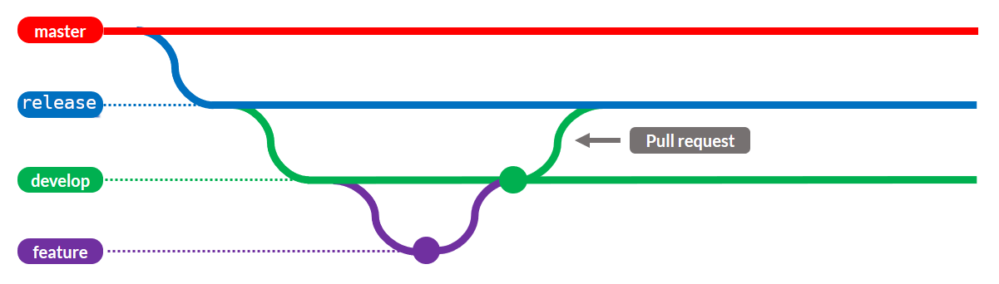

## [Gitflow](https://www.atlassian.com/es/git/tutorials/comparing-workflows/gitflow-workflow#:~:text=Gitflow%20es%20un%20modelo%20alternativo,vez%20y%20quien%20lo%20populariz%C3%B3.)

Gitflow ha sido diseñado para garantizar la calidad de los productos desarrollados, facilitar el trabajo colaborativo, y permitir un correcto versionamiento de los productos.

### 1. **Creación del repositorio**
Al crear el repositorio, la rama master debe albergar el código suficiente (código base) que permita a todos los desarrolladores poder trabajar sin depender unos de otros.
la nomenclatura correcta es la siguiente
`<cliente>-<area>-<iniciales-nombre-proyecto>-<descripcion-aplicacion>-<back/front>`
* Backend
  ```
  ejm: 
  corona-financiero-nmda-admision-back
  corona-financiero-nmda-autorizacion-back
  corona-financiero-nmda-control-cyc-back
  corona-financiero-nmda-control-ecert-back
  corona-financiero-nmda-control-equifax-back
  corona-financiero-nmda-control-previred-back
  corona-financiero-nmda-control-telco-back
  corona-financiero-nmda-control-vigatec-back
  corona-financiero-nmda-datos-central-back
  ```
* Frontend
  ```
  ejm:
  corona-financiero-nmda-portal-interno-admision-front
  corona-financiero-nmda-web-admision-front

  ```

### 2. **Creación de Ramas**

Se crean las ramas siguiendo el orden:
  * release desde master
  * develop desde release
  * features iniciales desde develop


### 4. **Desarrollo de funcionalidades**

El(Los) developer(s) trabaja sobre una rama de feature, la cual debe ser creada desde la rama de develop. Esta rama albergará el código del desarrollo de una funcionalidad y cuando esta sea finalizada (no antes) debe ser subida a al repositorio y posterior a eso realizar la integración con la rama de develop mediante la creacion de un [Pull request (PR)](https://www.youtube.com/watch?v=ZlPHGsojfaI)


### 5. **Pruebas de sistema nivel 1**

Las pruebas del sistema nivel 1 son las pruebas que aplica el equipo de QA al desarrollo para comprobar que las funcionalidades cumplen con lo definido en los escenarios de pruebas. Estas pruebas son llevadas por el tester y se ejecutan al integrar el desarrollo de un feature en la rama develop. Para ello se realizan los siguientes pasos:
  * El desarrollador, posterior a la mezcla de código en develop, genera un tag con el nombre del feature o issue y la fecha.
  * El desarrollador genera un [Pull request (PR)](https://www.youtube.com/watch?v=ZlPHGsojfaI) a release, indica el tag que debe usar para probar y asigna para su revisión al tester.
  * El tester valida los escenarios de calidad, esta tarea debe ir con un comentario del QA en el pull request. Para reportar issues sobre el producto.
  * Los pull requests se aprueban y desaprueban en el orden que se han colocado
  * Si el tester aprueba el pull request que proviene de una rama feature, esta rama debe ser eliminada, de lo contrario se debe trabajar en las incidencias reportadas en la rama hasta que se cuente con la aprobación.

### 6. **Pruebas de aceptación, carga, y seguridad**

Las pruebas de aceptación son realizadas por el usuario que ha solicitado el sistema para probar que la aplicación cumple con lo deseado previo al despliegue en productivo. Las pruebas de carga y seguridad, son pruebas técnicas realizadas para validar que el sistema cumple con los atributos de calidad que se esperan, tales como desempeño y seguridad. Para ello se realizan los siguientes pasos:
  * El desarrollador genera un tag sobre la rama release nombrándola con la fecha de las pruebas.
  * El tester comunica al equipo de despliegue (deployer) el despliegue del código en la rama de release sobre el servidor pre-productivo
  * El tester comunica a las áreas que el desarrollo puede ser sometido a pruebas de aceptación, carga o seguridad sobre el ambiente pre-productivo a las áreas correspondientes.
  * Posterior a las pruebas se comunica los escenarios de calidad y pruebas que aprobaron o no
  * Si el desarrollo ha sido finalizado completamente y las pruebas son satisfactorias, el tester o desarrollador crean un pull request a master solicitando la aprobación del mantainer y la revisión del equipo de desarrollo.

### 7. **Despliegue en producción**

Al cumplir con todas las pruebas el código es aprobado para ser mezclado en master generando una nueva versión de la aplicación. **Nota:** toda mezcla de código en master debe generar una nueva versión de la aplicación. Los pasos a seguir son:
  * El pull request es aprobado y mezclado a master
  * El mantainer crea un release de código siguiendo el [versionamiento semántico](../versioning/VERSIONING.md)
  * Se comunica al equipo de desarrollo que ha sido creada una nueva versión de la aplicación
  * Se asegura que release y master han quedado igualadas
  * Se organiza con el equipo de despliegue (deployers) los pasos para la puesta en producción
  * El equipo de despliegue despliega la nueva versión en producción
  * Se inicia un nuevo desarrollo

### 8. **Atención de errores en desarrollo**

Cuando se presenta un error en desarrollo, el error debe ser resuelto sobre la feature que incluyó el error. Si la rama aún está presente es necesario hacer un rollback a un punto de estabilidad del código de lo contrario es necesario hacer una rama para atender el issue y resolverlo pronto. Los pasos a seguir son:
  * Se reporta que hay un issue en desarrollo por medio del tablero de issues y se asigna al desarrollador y al mantainer. Para reportar issues sobre el producto revise [nuestras normas de estilo](../style/WRITE_BUG.md)
  * Si el error es por un feature que acabó de ser incluido y para el cual la rama aún existe, se hace rollback al cambio y soluciona en dicha rama. Mezclar los cambios con develop siguiendo los pasos 3 y 4.
  * Si el error es por un feature agregado previamente y para el cual su rama ya fue cerrada, se crea una rama de issue y se asigna al desarrollador correspondiente. Este desarrollo sigue igualmente los pasos 3 y 4.
  * Si el error ya ha sido resuelto y probado se elimina la rama de issue.

### 9. **Atención de errores en producción**

Cuando se presenta un error en producción y se considera que el error es bloqueante, crítico o que no puede esperar a una nueva versión de código se debe manejar con una rama de hotfix. Sino es así se debe manejar con una rama de issue. Los pasos a seguir son:
  * Determinar la gravedad del issue en producción en conjunto con el líder funcional
  * Si se considera que no es crítico, bloqueante y puede esperar a un nuevo release, se crea una nueva rama de issue y se trabaja como en el paso 3 y 4.
  * Si se considera que no puede esperar a un nuevo release de la aplicación, se crea una rama hotfix a partir de master.
  * Cuando se resuelve el error, se crea un pull request a master el cual requiere aprobación del tester del equipo y del mantainer. Para la creación de pull request revise [nuestras normas de estilo](PULL_REQUESTS.md)
  * Se crea un nuevo release haciendo uso del [versionamiento semántico](VERSIONING.md)
  * El cambio debe ser mezclado al tiempo sobre la rama de develop, esta mezcla se puede realizar con merge.
  * Al finalizar se elimina la rama de hotfix

### 10. **Rollback de versiones**
Si se presenta que una versión de la aplicación en productivo presenta una falla de estabilidad del producto, es potestad del equipo (desarrollo, operaciones, líder funcional) definir si volver a un estado anterior de la aplicación para ello el equipo debe:
  * Asegurarse que los problemas presentados no son replicables en el release anterior de la aplicación.
  * Marcar en github que el último release ahora es un pre-release, es decir, que no es un release productivo.
  * Desplegar la versión anterior de la aplicación
  * Comentar que la versión no se considera estable, y al publicar una nueva versión esta debe ser diferente, nunca la misma.
